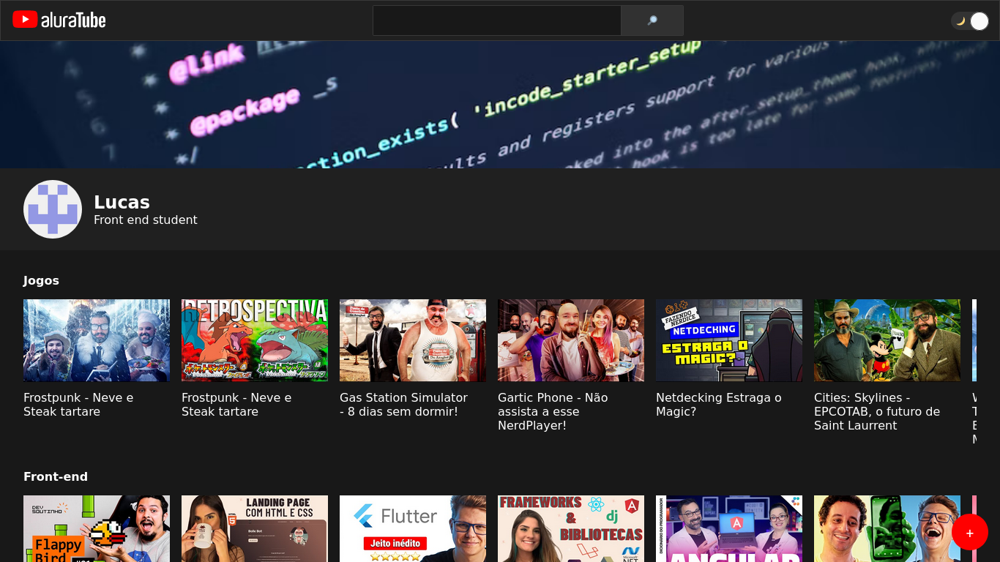

# aluratube

[clique aqui para ir para o site](https://aluratube-gamma-nine.vercel.app)

---

## Resumo
aluratube - projeto desenvolvido na imersão react 5 da alura 

Nesse projeto foi desenvolvido um site baseado no Youtube com opção de dark e light mode e campo de pesquisa para filtragem dos videos.

O Aluratube lista videos da plataforma Youtube com a imagem de thumbnail e um titulo personalizado, os videos são adicionados ao banco de dados(supabase) e listados em playlists separadas.

## Tecnologias utilizadas:
- [React JS](https://pt-br.reactjs.org/) como biblioteca
- [Next.JS](https://nextjs.org/) como framework
- [vercel](https://vercel.com) para fazer o deploy do site
- [supabase](https://supabase.com/) como banco de dados

## Melhorias a serem feitas:
- Adicionar uma validação no formulário de adição do video
- Adicionar a seleção de em qual playlist adicionar o video
- Adicionar links para conexão com o desenvolvedor do projeto